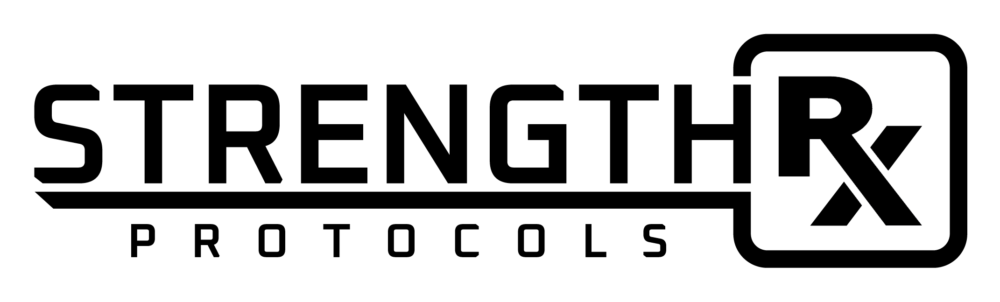

<h1 align="center">Strength Rx Protocols</h1>

<p align="center">
  
  <br>
  <i>Strength Rx Protocols is a hybrid progressive web app built with angular.
    <br>Angular is a development platform for building mobile and desktop web applications
    <br> using Typescript/JavaScript and other languages.</i>
  <br>
</p>

<p align="center">
  <a href="https://www.angular.io"><strong>www.strengthrx.pro</strong></a>
  <br>
</p>

## Angular Fundamentals

Get started with Angular, learn the fundamentals and explore advanced topics on our documentation website.

- [Getting Started][quickstart]
- [Architecture][architecture]
- [Components and Templates][componentstemplates]
- [Forms][forms]
- [Lazy Loading][lazyloading]


### State Management
[@NgRx Store](https://ngrx.io/guide/store/why) provides reactive state management for Angular apps inspired by Redux. Unify the events in your application and derive state using [RxJS][rxjs].

<p>StrengthRx's implements entities using [@ngrx/entity](https://ngrx.io/guide/entity) package.

Note: The NgRx services to interact with Angular components using the Facade Pattern
@see https://thomasburlesonia.medium.com/ngrx-facades-better-state-management-82a04b9a1e39
</p>

### Prerequisites

- Install [Node.js] which includes [Node Package Manager][npm]

### Setting Up a Project

Install the Angular CLI globally:

```
npm install -g @angular/cli
```

Create workspace:

```
ng new [PROJECT NAME]
```

Run the application:

```
cd [PROJECT NAME]
ng serve
```

## Upgrading

Check out our [upgrade guide](https://update.angular.io/) to find out the best way to upgrade your project.


**Love Angular? Give our repo a star :star: :arrow_up:.**

[quickstart]: https://angular.io/start
[ng]: https://angular.io
[documentation]: https://angular.io/docs
[angularmaterial]: https://material.angular.io/
[cli]: https://cli.angular.io/
[architecture]: https://angular.io/guide/architecture
[componentstemplates]: https://angular.io/guide/displaying-data
[forms]: https://angular.io/guide/forms-overview
[lazyloading]: https://angular.io/guide/lazy-loading-ngmodules
[node.js]: https://nodejs.org/
[npm]: https://www.npmjs.com/get-npm
